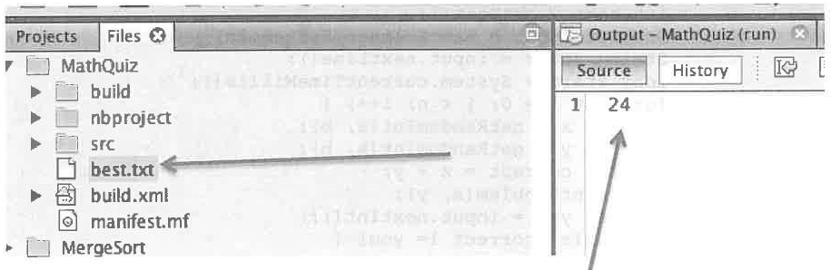

# 11. MathQuiz

**Description:** Solve arithmetic problems as fast you can. Besides the java file, the code uses a file called best.txt. There is only one number in best.txt, the fewest seconds that the user has taken to solve the randomly generated set of arithmetic problems.



best.txt has only one number in it, the best time (seconds) that the quiz has been completed in so far.

## Code

```java
package asu.mathquiz;
import java.io.File;
import java.io.FileNotFoundException;
import java.io.PrintWriter;
import java.util.Scanner;
public class MathQuiz {
    public static void main(String[] args) throws FileNotFoundException {
        int n = 5; //number of problems to solve
        int m = 3; //number of digits in the numbers
        int a = (int) Math.pow(10, m - 1);
        int b = (int) Math.pow(10, m) - 1;
        int n_wrong = 0;
        int best = getBest();
        Scanner input = new Scanner(System.in);
        String enter = input.nextLine();
        long start = System.currentTimeMillis();
        for (int i = 0; i < n; i++) {
            int x = getRandomInt(a, b);
            int y = getRandomInt(a, b);
            int correct = x + y;
            printProblem(x, y);
            int you = input.nextInt();
            while (correct != you) {
                n_wrong++;
                System.out.println("incorrent, try again:");
                printProblem(x, y);
                you = input.nextInt();
            }
        }
        finish(start, best, n_wrong);
    }
    
    public static void finish(long start, int best, int n_wrong) throws FileNotFoundException {
        long t = System.currentTimeMillis() - start;
        long yourTime = t / 1000;
        System.out.println("Seconds = " + yourTime);
        System.out.println("Wrong = " + n_wrong);
        if (yourTime < best) {
            System.out.println("New Best Time: " + yourTime);
            File bestFile = new File("best.txt");
            PrintWriter output = new PrintWriter(bestFile);
            output.print(yourTime);
            output.close();
        }
    }
    
    public static int getBest() throws FileNotFoundException {
        File file = new File("best.txt");
        Scanner getBest = new Scanner(file);
        int best = getBest.nextInt();
        System.out.println("Best = " + best + " seconds");
        System.out.println("Solve the following problems as quick as you can.");
        System.out.println("Hit enter to start the problems and the time");
        return best;
    }
    
    public static void printProblem(int x, int y) {
        int length = ("" + x).length();
        System.out.println("  " + x);
        System.out.println(" +" + y);
        System.out.print(" ");
        for (int j = 0; j < length; j++) {
            System.out.print("-");
        }
        System.out.println("");
    }
    
    public static int getRandomInt(int a, int b) {
        return (int) ((b + 1 - a) * Math.random() + a);
    }
}
```

## Output

```
best = 24 seconds
Solve the following problems as quick as you can.
Hit enter to start the problems and the timer.

  849
 +924
  ---
 1773
  252
 +882
  ---
1134
  929
 +477
  ---
1397
  354
 +803
  ---
1157
Seconds = 46
wrong = 0   
```
